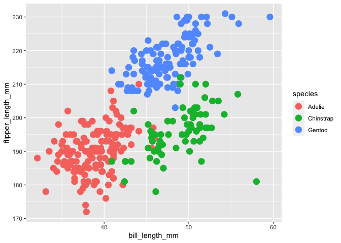

Homework 1
================
Vasili Fokaidis

This is my solution to HW1.

``` r
library(tidyverse)
```

    ## ── Attaching packages ───────────── tidyverse 1.3.0 ──

    ## ✓ ggplot2 3.3.2     ✓ purrr   0.3.4
    ## ✓ tibble  3.0.3     ✓ dplyr   1.0.2
    ## ✓ tidyr   1.1.2     ✓ stringr 1.4.0
    ## ✓ readr   1.3.1     ✓ forcats 0.5.0

    ## ── Conflicts ──────────────── tidyverse_conflicts() ──
    ## x dplyr::filter() masks stats::filter()
    ## x dplyr::lag()    masks stats::lag()

## Problem 1

Create a data frame with the specified elements.

``` r
prob1_df =
tibble(
  samp = rnorm(10),
  samp_gt_0 = samp > 0,
  char_vec = c("a", "b", "c", "d", "e", "f", "g", "h", "i", "j"),
  factor_vec = factor(c("low", "low", "low", "mod", "mod", "mod", "mod", "high", "high", "high"))
)
```

Take the mean of each variable in my data frame.

``` r
mean(pull(prob1_df, samp))
```

    ## [1] 0.03476151

``` r
mean(pull(prob1_df, samp_gt_0))
```

    ## [1] 0.6

``` r
mean(pull(prob1_df, char_vec))
```

    ## Warning in mean.default(pull(prob1_df, char_vec)): argument is not numeric or
    ## logical: returning NA

    ## [1] NA

``` r
mean(pull(prob1_df, factor_vec))
```

    ## Warning in mean.default(pull(prob1_df, factor_vec)): argument is not numeric or
    ## logical: returning NA

    ## [1] NA

I can take the mean of numbers and logical, but not character or factor.

``` r
as.numeric(pull(prob1_df, samp))
```

    ##  [1] -0.5753707  0.6260499  0.7987543 -0.9069471 -0.8257994 -2.1179902
    ##  [7]  1.4489044  0.2681719  0.6160919  1.0157502

``` r
as.numeric(pull(prob1_df, samp_gt_0))
```

    ##  [1] 0 1 1 0 0 0 1 1 1 1

``` r
as.numeric(pull(prob1_df, char_vec))
```

    ## Warning: NAs introduced by coercion

    ##  [1] NA NA NA NA NA NA NA NA NA NA

``` r
as.numeric(pull(prob1_df, factor_vec))
```

    ##  [1] 2 2 2 3 3 3 3 1 1 1

Convert the logical vector to numeric, and multiply the random sample by
the result, then convert the logical vector to a factor, and multiply
the random sample by the result, and lastly, convert the logical vector
to a factor and then convert the result to numeric, and multiply the
random sample by the result.

``` r
as.numeric(pull(prob1_df, samp_gt_0)) * pull(prob1_df, samp)
```

    ##  [1] 0.0000000 0.6260499 0.7987543 0.0000000 0.0000000 0.0000000 1.4489044
    ##  [8] 0.2681719 0.6160919 1.0157502

``` r
as.factor(pull(prob1_df, samp_gt_0)) * pull(prob1_df, samp)
```

    ## Warning in Ops.factor(as.factor(pull(prob1_df, samp_gt_0)), pull(prob1_df, : '*'
    ## not meaningful for factors

    ##  [1] NA NA NA NA NA NA NA NA NA NA

``` r
as.numeric(as.factor(pull(prob1_df, samp_gt_0))) * pull(prob1_df, samp)
```

    ##  [1] -0.5753707  1.2520997  1.5975085 -0.9069471 -0.8257994 -2.1179902
    ##  [7]  2.8978088  0.5363439  1.2321837  2.0315005

## Problem 2

Load penguins dataset.

``` r
data("penguins", package = "palmerpenguins")
head(penguins)
```

    ## # A tibble: 6 x 8
    ##   species island bill_length_mm bill_depth_mm flipper_length_… body_mass_g sex  
    ##   <fct>   <fct>           <dbl>         <dbl>            <int>       <int> <fct>
    ## 1 Adelie  Torge…           39.1          18.7              181        3750 male 
    ## 2 Adelie  Torge…           39.5          17.4              186        3800 fema…
    ## 3 Adelie  Torge…           40.3          18                195        3250 fema…
    ## 4 Adelie  Torge…           NA            NA                 NA          NA <NA> 
    ## 5 Adelie  Torge…           36.7          19.3              193        3450 fema…
    ## 6 Adelie  Torge…           39.3          20.6              190        3650 male 
    ## # … with 1 more variable: year <int>

``` r
names(penguins)
```

    ## [1] "species"           "island"            "bill_length_mm"   
    ## [4] "bill_depth_mm"     "flipper_length_mm" "body_mass_g"      
    ## [7] "sex"               "year"

## The penguins data set shows the various species of penguins and their geographical locations. It also shows bill length (mm), bill depth (mm), flipper length (mm), body mass (g), sex, and year. Some interesting values are the maximum and minimum flipper and bill lengths (mm) which are 231 and 172, and 59.6 and 32.1, respectively. The dataset has 344 rows and 8 columns. The mean flipper length (mm) in the dataset is 200.92.

## Scatter Plot of Flipper Length (mm) vs. Bill Length (mm)

``` r
ggplot(penguins, aes(x = bill_length_mm, y = flipper_length_mm, color = species)) + geom_point(size = 4)
```

    ## Warning: Removed 2 rows containing missing values (geom_point).

<!-- -->

``` r
ggsave(
  "HW1_plot.png"
)
```

    ## Saving 7 x 5 in image

    ## Warning: Removed 2 rows containing missing values (geom_point).
